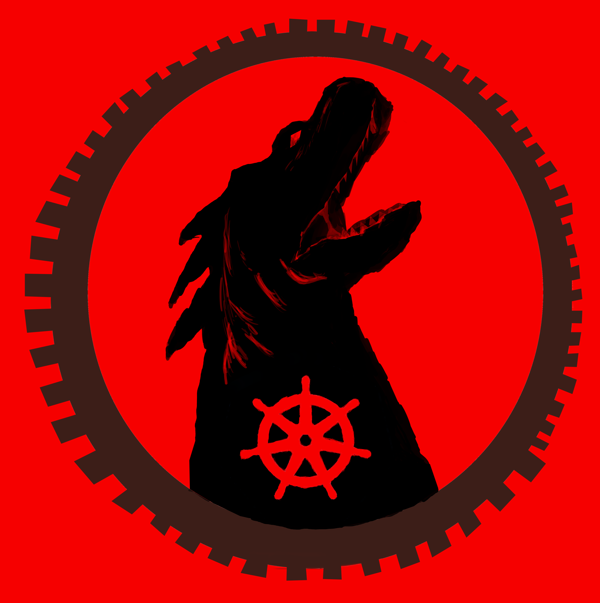

# Gameserver-rs, Game hosting for kubernetes and beyond!
[](https://discord.gg/XARWzcuCGW)
<!--  -->


**NOT READY FOR PRODUCTION** 
Currently alot of Kubernetes specific features do not work yet, like moving games to specific nodes, redundancy, etc but by editing the deployment in src/gameserver, you can add a nodeSelector for the server hosting the game.

I dont recommend this for not tech-savvy users at the moment, and even then I would mostly recommend it to contributers who can help get this to users.

# Contributing

Contributers are welcome! Seriously, this project really needs contributers at the moment, currently we dont support alot of kubernetes features at the moment, nor providers, so contributers will get us closer to the goal of going mainstream

We use svelte and rust, and with rust we use axum as the routing framework, you can write in native HTML in src/svelte/static

# Running it 
Running it in kubernetes:
```
$ docker run -d -p 5000:5000 --name my-registry registry:2
$ git clone https://github.com/SpiderUnderUrBed/gameserver-rs.git
$ cd gameserver-rs
$ kubectl apply -f .
$ cd src/gameserver 
```
EDIT:
You no longer need to run npm install and build when setting it up
(Fixed in moving the npm install in the Dockerfile)

Thats it!
**If you want a single deployment which would pull the image from dockerhub, it is not avalible at the moment**, which is why you have to use the registry, I plan on uploading it as soon as this project gains a tiny bit of traction

Running it on the host system (not kubernetes):
```
$ chmod +x install.sh
$ ./install.sh
```
This is the simplest way to install it, but you lose some features you would have have on kubernetes

Running it for testing: \
Given that the docker file uses cargo-watch, as long as you edited the deployment to mount the project directory directly to its proper position, you should be able to test this normally, but this project also supports being ran on a host, just run:
```
cargo run .
```
but if you want to use postgres (and not the json backend) 
```
cargo run . --features backend
```
(but it should run with postgres by just applying the deployment, with or without testing)

** Modifying the k8s config ** 
If you want to modify the k8s config, more specifically the one under src/gamserver/deployment.yaml
You need the comments between each important section if you have automatic building of the image enabled 
(e.g comments between pv,pvc,etc)

**For kubernetes testing:** \
As for other stuff to use for the testing environment, look to the deployment-dev.yaml, you might want to adjust the settings with this too but it provides better defaults, and the deployment in src/gameserver, if you enable TESTING="true" in the deployment (which is the default in deployment-dev.yaml at the root of the project), it would run the equivalent deployment-dev.yaml in src/gameserver, which I use for my own personal testing, so i recommend editing that, and adding it to your .gitignore (I added a nodeSelector to one of my nodes, so you'll HAVE to edit it)

**NOTES**
For nixos users this command might be useful:
```
 nix-shell -p cargo rustc openssl pkg-config
```