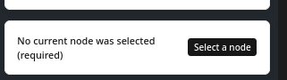
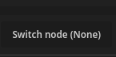
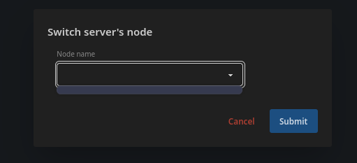
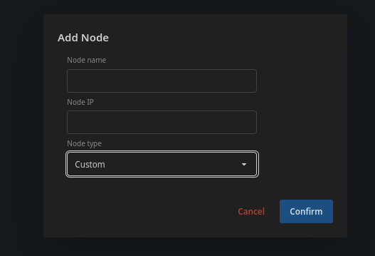
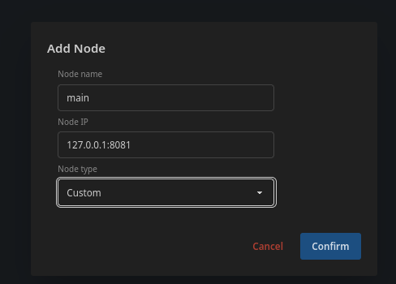
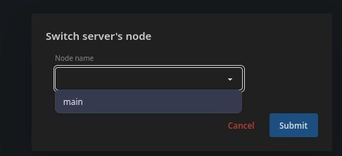
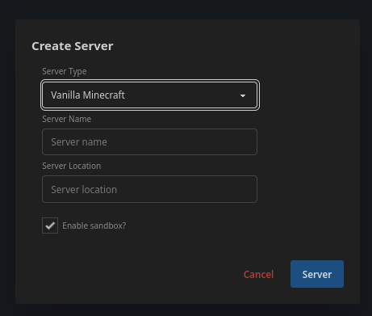
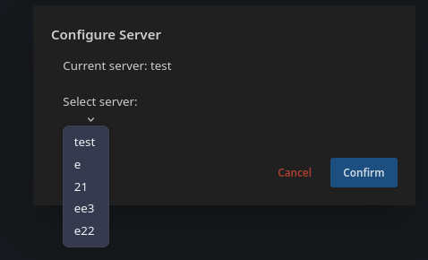
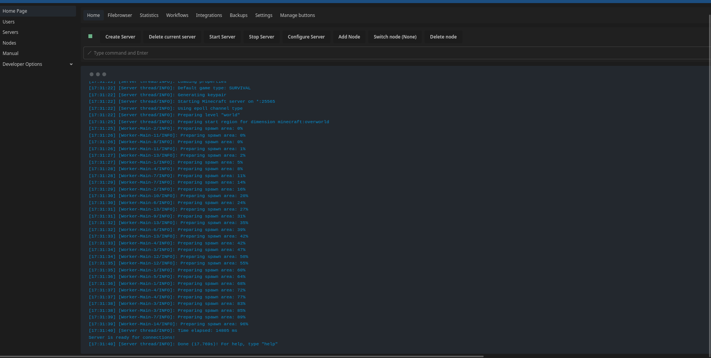

# Welcome to gameserver-rs
## Getting started:
If your new to using this

click to see the comprehensive "How to" guide

### How to

To get started you need to make sure your connected to a node, 
you should get an alert that you are connected to a node via notification

See (will appear at bottom right of your screen):

Or can be indicated via (top bar):

In this case there is no node selected, if this is the case for you, open the dialog and select a node:

There seems to be no node, so you can go ahead and add one, you need to exit the dialog then click "add node"

For now always select custom, initial gameserver does not add anything

Now you can create the node, it should output in console if the node was created properly
once it has been created, go to the node dialog

You should see the node added as the image above states, select the node, then "confirm"

You now should be switched to that node, now lets get to making a minecraft server,
press "create server" in the top bar

Now you can fill in the details
**you have to give the server a name**, 
location is optional, useful when making multiple servers (see [Multiple Servers](#multiple-servers))

Sandbox **will only work if you or the admin of the panel ran the gameserver process in root** (either in docker or host)

Sandbox just adds an extra layer of distance between a given process and the container, depending on how you setup the container, it could be secure enough, interactions between the gameserver process and the main server should be hard to exploit, so dont consider this setting too important (for more explinations on the architecture, see [Architecture](#architecture))

We are trying minecraft, which is offically supported and an implimentation added by default, if you would like to use something else see [Custom Servers](#custom-servers)

Once you create your server, see that the console does not throw an error, if it includes something like 

`409 Conflict`
You made a duplicate in name, it wont warn you about location, it will simply write the server files
to the same directory

if it did not error, it should run the creation hooks, if it did not run, you should check if the correct server is configured

check the "Configure Servers" tab

If your server is not listed as "current server" click it on the dialog and click "confirm"
You should see the "current server" exit, if nothing is running press "start server", it will run the creation hook, now we can move onto actually starting the server

To start the server, press "start server", if you already pressed this to run the creation hook, then press it again, it should start the server

Congrats! You have set up your first server, this is the end of the "How to" section, apply what 
you learned here to create a node, switch to that node, create a server, switch to that server and then start it, it is recommended you read the rest of the manual

## Whats specifically k8s
For k8s, alot on the setup is covered in the readme in the repo on github, [repo link](https://github.com/SpiderUnderUrBed/gameserver-rs)

In terms of the panel, you should have some nodes, and pods in your nodes list, nodes will be used for catagorization when you enable the node bar (see [Node bar](#node-bar))

Typically the system will pick up pods with the name "gameserver" in the pod name (if not it will pick up all pods), in the future it will use a dedicated label, but regardless, you should be aware of which pod you will be using for the gameserver, and switch to that in the "switch node" dialog

<h2 id="node-bar">
Node bar
</h2>

<h2 id="multiple-servers">

## Multiple servers
test
</h2>
<h2 id="custom-servers">

## Custom servers
test
</h2>

## Administration

<h2 id="architecture">

## Architecture
The architecture is unique compared to some other platfroms in the sense that you have one main server,
this manages 
</h2>
